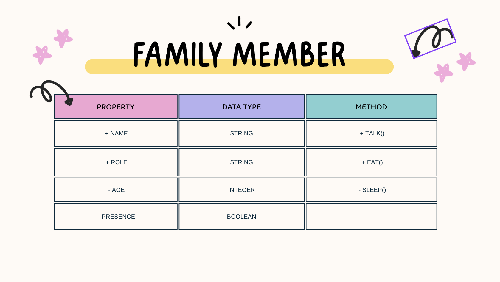

]# Class Attributes and Methods 

## Previous Design

Link to my previous activity: [classObjectUml.md](classObjectUML.md)

## Design Revision

Original class was unchanged 

## Visibility Decisions 

| Attribute | Data Type | Visibility | Why Public/Private? | 

| - Age | Integer | Private | Because age can be used in bad ways |

| + Role | String  | Public | Helpful to know |

| + Name  | String | Public | Helpful to know | 

| - Prescence | Boolean | Private | Can be helpful but house might be robbed when nobody is present |

## Updated UML Class Diagram 

## Python Implementation
[View Python Source](Q1/classimplementation.py)

## Object Diagram 
![Object Diagram] (![Uploading Screenshot 2026-09-09 at 12.48.04 AM.png…])

